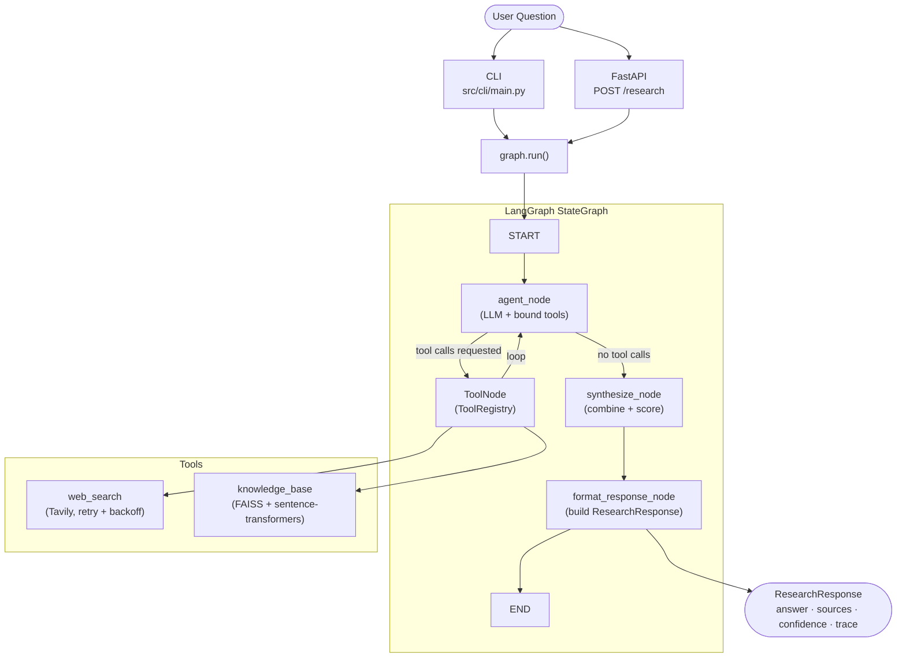

# Agentic Research Assistant

An LLM-powered research agent that accepts a natural-language question, autonomously
decides which tools to call, and returns a structured response containing a cited answer,
ranked sources, a numeric confidence score, and a full decision trace. Built with
[LangGraph](https://github.com/langchain-ai/langgraph) and
[Claude](https://www.anthropic.com/claude) as the reasoning backbone, the agent queries
the live web via Tavily and a local FAISS knowledge base, synthesises findings into a
single coherent answer, and degrades gracefully when any tool is unavailable — never
surfacing a raw stack trace to the user.

---

## Architecture



### How the agent works

1. **Input** — A `ResearchQuestion` enters the graph as a `HumanMessage`.
2. **Agent node** — The LLM (Claude) is bound to all registered tools. It reasons about
   the question and either calls one or more tools or proceeds directly to synthesis.
3. **Tool loop** — LangGraph's prebuilt `ToolNode` executes the requested tools
   (`web_search`, `knowledge_base`) and feeds results back to the agent. The loop
   continues until the LLM decides no further tool calls are needed.
4. **Synthesize node** — Retrieved results are merged, deduplicated, and ranked.
   A confidence score is computed from source count, average relevance, and degradation
   penalties. If confidence < 0.5, an explicit uncertainty statement is prepended to the
   answer.
5. **Format response node** — A `ResearchResponse` is assembled from the final state,
   including the optional `DecisionTrace` (one `ToolCall` entry per tool invoked).
6. **Output** — The response is returned to the CLI or API caller.

All external I/O is `async/await`. Every node emits a structured JSON log line via
`structlog`. Tools retry up to `MAX_RETRIES` times with exponential backoff and return
empty results (not exceptions) on exhaustion, keeping the agent operational in degraded
mode.

---

## Prerequisites

| Requirement | Version |
|---|---|
| Python | 3.11 or newer |
| [Poetry](https://python-poetry.org/docs/#installation) | 1.8+ |
| Anthropic API key | [console.anthropic.com](https://console.anthropic.com) |
| Tavily API key | [app.tavily.com](https://app.tavily.com) |

The FAISS knowledge base is **optional**. If no index is found at `FAISS_INDEX_PATH`
the agent continues using web search and LLM knowledge only.

---

## Installation

```bash
# 1. Clone the repository
git clone https://github.com/Nbiden/agentic-research-assistant.git
cd agentic-research-assistant

# 2. Install dependencies
poetry install

# 3. Configure environment variables
cp .env.example .env
```

Edit `.env` and fill in your API keys:

```dotenv
# Required
ANTHROPIC_API_KEY=sk-ant-...
TAVILY_API_KEY=tvly-...

# Optional — defaults shown
CLAUDE_MODEL=claude-sonnet-4-20250514
LOG_LEVEL=INFO
FAISS_INDEX_PATH=./data/knowledge_base.index
FAISS_DOCUMENTS_PATH=./data/documents.pkl
MAX_RETRIES=3
RETRY_BASE_DELAY=1.0
```

> **Never commit `.env` to version control.** It is listed in `.gitignore`.

---

## Usage

### CLI

```bash
# Ask a question
poetry run research-agent "What are the key differences between RAG and fine-tuning?"

# Limit the number of cited sources
poetry run research-agent "Explain transformer attention" --max-sources 3

# Suppress the decision trace
poetry run research-agent "Latest developments in AI safety" --no-trace

# Machine-readable JSON output
poetry run research-agent "What is FAISS?" --json

# Read question from stdin
echo "What is LangGraph?" | poetry run research-agent
```

Example human-readable output:

```
Research Question
─────────────────────────────────────────────────────────────────────
What are the key differences between RAG and fine-tuning?

Answer
─────────────────────────────────────────────────────────────────────
RAG (Retrieval-Augmented Generation) and fine-tuning differ in how
they adapt LLMs to specific knowledge domains. [1] RAG augments a
frozen model at inference time by retrieving relevant passages ...

Sources (3)
  [1] https://example.com/rag-vs-finetuning  (relevance: 0.94)
  [2] https://arxiv.org/abs/2312.00000        (relevance: 0.87)
  [3] doc_042                                 (relevance: 0.81)

Confidence: 0.83   Degraded: No
```

### REST API

Start the server:

```bash
poetry run uvicorn src.api.routes:app --host 0.0.0.0 --port 8000 --reload
```

Submit a question:

```bash
curl -X POST http://localhost:8000/research \
  -H "Content-Type: application/json" \
  -d '{
    "question": "What is retrieval-augmented generation?",
    "max_sources": 3,
    "include_trace": true
  }'
```

Health check:

```bash
curl http://localhost:8000/health
# {"status": "ok", "version": "0.1.0"}
```

#### Response schema

```jsonc
{
  "answer": "RAG combines retrieval with generation ...",
  "sources": [
    {
      "content": "...",
      "identifier": "https://example.com/rag",
      "relevance_score": 0.94,
      "source_type": "web"    // "web" | "knowledge_base" | "llm"
    }
  ],
  "confidence_score": 0.83,  // 0.0–1.0; <0.5 triggers uncertainty language
  "degraded": false,
  "generated_at": "2026-03-19T22:00:00Z",
  "decision_trace": {        // null when include_trace=false
    "nodes_visited": ["agent", "tools", "synthesize", "format_response"],
    "total_elapsed_ms": 4821,
    "tool_calls": [
      {
        "tool_name": "web_search",
        "rationale": "Need current information about RAG architectures",
        "input_summary": "RAG architecture 2025",
        "output_summary": "3 results retrieved",
        "success": true,
        "elapsed_ms": 1203
      }
    ]
  }
}
```

---

## Project structure

```text
src/
├── agent/
│   ├── graph.py          # StateGraph wiring: nodes, ToolNode, edges, compile()
│   ├── nodes.py          # agent_node, synthesize_node, format_response_node
│   ├── router.py         # research_router: wraps tools_condition
│   └── state.py          # AgentState(MessagesState) + ToolResult TypedDict
├── tools/
│   ├── __init__.py       # Tool registration — the only file to edit when adding tools
│   ├── base.py           # ToolRegistry singleton
│   ├── web_search.py     # Tavily async web search with retry + fallback
│   ├── knowledge_base.py # FAISS vector retrieval with sentence-transformers
│   └── synthesizer.py    # combine_sources(), compute_confidence()
├── models/
│   ├── request.py        # ResearchQuestion (Pydantic v2)
│   └── response.py       # ResearchResponse, Source, ToolCall, DecisionTrace
├── api/
│   └── routes.py         # FastAPI: POST /research, GET /health
├── cli/
│   └── main.py           # Typer CLI entry point
└── config.py             # Settings loaded from environment via python-dotenv

tests/
├── unit/                 # Per-module unit tests (mocked externals)
│   ├── test_agent/
│   ├── test_tools/
│   └── test_models/
├── integration/          # End-to-end flow with stubbed tools
└── contract/             # FastAPI TestClient contract tests

specs/001-core-research-agent/  # Design artifacts (spec, plan, data-model, contracts)
```

---

## Adding a new tool

Adding a tool requires changes to **one file only** — `src/tools/__init__.py`. The graph
reads the registry at compile time, so the new tool is automatically included in the
`ToolNode` without touching `graph.py`, `nodes.py`, or `router.py`.

**Step 1** — Create the tool in `src/tools/`:

```python
# src/tools/my_tool.py
"""My custom tool for the research agent."""

from __future__ import annotations

import structlog
from langchain_core.tools import tool

from src.agent.state import ToolResult

logger = structlog.get_logger(__name__)


@tool
async def my_tool(query: str) -> list[ToolResult]:
    """One-line description used by the LLM to decide when to call this tool.

    Args:
        query: The search query derived from the research question.

    Returns:
        List of ToolResult dicts, or empty list on failure.
    """
    logger.info("my_tool.start", query=query[:100])
    # ... your implementation ...
    return []
```

**Step 2** — Register it in `src/tools/__init__.py`:

```python
from src.tools.base import registry
from src.tools.knowledge_base import knowledge_base
from src.tools.my_tool import my_tool          # add this
from src.tools.web_search import web_search

registry.register(web_search)
registry.register(knowledge_base)
registry.register(my_tool)                      # add this
```

That's it. The agent will now consider `my_tool` alongside the existing tools on every
query.

---

## Running tests

```bash
# All tests
poetry run pytest

# Unit tests only
poetry run pytest tests/unit/

# Integration tests (requires valid API keys in .env)
poetry run pytest tests/integration/

# Contract tests (FastAPI routes, no real API calls)
poetry run pytest tests/contract/

# With coverage report
poetry run pytest --cov=src --cov-report=term-missing
```

### Lint and format

```bash
# Check for violations
poetry run ruff check .

# Auto-fix safe violations
poetry run ruff check . --fix

# Apply formatting
poetry run ruff format .
```

CI fails on any Ruff violation.

---

## License

This project is released under the [MIT License](LICENSE).
